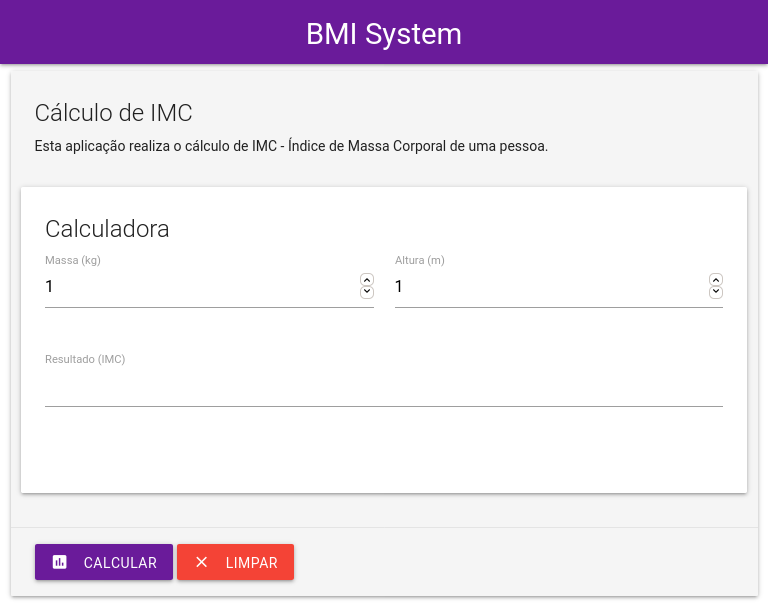
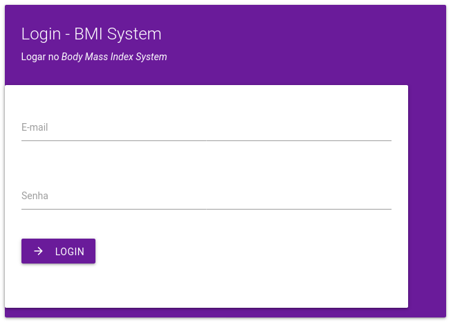

# BMI System
*Springboot BMI application to apply tests Page Object Pattern and Fluent Interface with Selenium in Functional Tests*.

Este sistema está sob desenvolvimento para fins de estudos em **Testes funcionais, unitários, de integração, carregamento e segurança**.

A primeira etapa do desenvolvimento foca em Testes Funcionais de Sistemas com Selenium, aplicando o *Page Object Pattern* e *Fluent Interface* com **Selenium Webdriver**.

	</img>

No momento o sistema não faz nenjum tipo de comunicação com o banco de dados, podem ser testado livremento em qualquer máquina com uma IDE de Java instalada.

	</img>

**TODO**

Do examples of:
* [ ] Test Cases
* [ ] Functioal Tests
* [ ] Unit Tests
* [ ] Interation Tests
* [ ] Loading Tests
* [ ] Security Tests